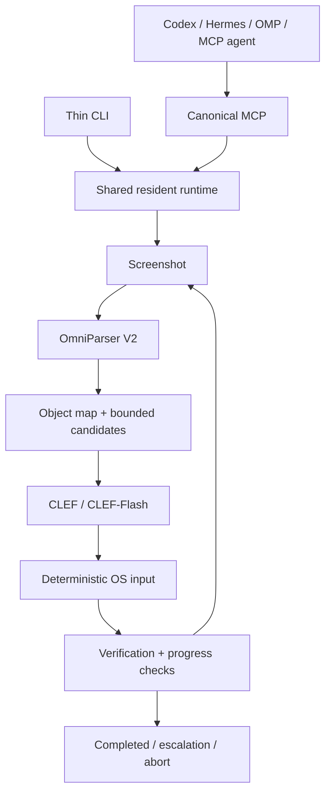

# clef-use

[English](README.md) | [한국어](docs/ko/QUICKSTART.md) | [简体中文](docs/zh-CN/QUICKSTART.md) | [日本語](docs/ja/QUICKSTART.md)

**One local computer-use runtime. One MCP interface. A fast decision loop.**

clef-use turns a high-level GUI goal into a bounded sequence of visual actions.
OmniParser detects screen objects; CLEF selects semantic action candidates;
deterministic input adapters execute them. Your planner gets control back at a
terminal event instead of making an inference for every click.



## Install

The canonical distribution URL is:

```sh
curl -fsSL https://ftp.kotori9.dev/clef-use/install.sh | sh
```

Windows PowerShell:

```powershell
irm https://ftp.kotori9.dev/clef-use/install.ps1 | iex
```

The installer installs the CLI/MCP runtime only. **It does not download models
or install inference dependencies.** Before the first GUI task:

```sh
clef-use models prepare
clef-use doctor
```

`models prepare` installs the inference environments, downloads missing model
weights, initializes the workers and saves their configuration. Model preparation
requires Python 3.11/3.12, Git and sufficient disk space. Set `model_dir` to your
chosen cache or external SSD path before preparation; see [installation](docs/INSTALL.md).
Runtime installation supports Python 3.11-3.13 with `venv` and `pip`; no root is
needed. Updates retain the model cache.

For a source checkout:

```sh
uv sync --locked --no-editable
uv run clef-use doctor
```

## Quick start

```sh
clef-use models prepare
clef-use doctor
clef-use install-mcp codex
clef-use install-mcp hermes
clef-use install-mcp omp
clef-use run 'In the open Calculator, compute 123 * 456' --success 'Calculator shows 56088'
clef-use status
clef-use abort
clef-use update
```

Prepare installs pinned ML environments and downloads pinned upstream weights.
Use `model_dir` in [configuration](docs/INSTALL.md) for an external SSD or mirror cache.
CLEF-Flash alone needs approximately 19.1 GB of weight storage. The larger CLEF
needs approximately 55 GB. Cold model loading is separate from inner-loop timing.

## MCP

```json
{"mcpServers":{"clef-use":{"command":"clef-use","args":["mcp"]}}}
```

Five high-level tools: `computer_run`, `computer_continue`, `computer_observe`,
`computer_status`, and `computer_abort`. No harness-specific executor is required.
The CLI and all stdio MCP processes connect to the same authenticated loopback
service, sharing loaded models and exclusive desktop input ownership.
See [MCP](docs/MCP.md) and [harness setup](docs/en/HARNESS_SETUP.md).

## Platforms and verification

V0 targets primary-monitor macOS, Linux and Windows desktops. Windows has a
first-class PowerShell installer; model/GUI compatibility outside the measured
macOS setup remains experimental. Headless environments support protocol,
state-machine, packaging and installer tests. Desktop permissions and an actual
GUI are required for real tasks. CUDA, MPS and CPU availability is detected;
availability does not establish model compatibility. Measured results and
limitations are recorded in [evidence](docs/evidence/VALIDATION.md).

Benchmarks distinguish fixture overhead from real model/desktop latency. No
speedup against conventional VLM computer use is claimed without a controlled
comparison. See [benchmarking](docs/BENCHMARK.md).

## Safety

Hard budgets, confidence checks, stale-screen checks, repeated-state detection,
explicit cancellation and owned-input release bound execution. Text entry uses
exact supplied or goal-extracted literals. Password-like targets are refused.
Constraints are model-assisted; this runtime is **not an OS sandbox**. Screen
content can be malicious, and a decision model can make mistakes. Use an isolated
desktop with non-sensitive tasks. Screenshots stay local unless a planner
explicitly requests an MCP image. No shell execution tool is exposed.

## Documentation

- [Installation and removal](docs/INSTALL.md)
- [Architecture and invariants](docs/ARCHITECTURE.md)
- [Development and testing](docs/DEVELOPMENT.md)
- [Benchmarks](docs/BENCHMARK.md)
- [English setup](docs/en/INSTALL.md), [한국어](docs/ko/INSTALL.md),
  [简体中文](docs/zh-CN/INSTALL.md), [日本語](docs/ja/INSTALL.md)
- [Contributing](CONTRIBUTING.md), [security reporting](SECURITY.md),
  [changelog](CHANGELOG.md)

## License

Runtime code: Apache-2.0. Model code, weights and dependencies retain their
upstream licenses. The pinned OmniParser YOLOv9 detector uses MIT-licensed code;
earlier Ultralytics detectors carry different licensing. See
[third-party notices](THIRD_PARTY_NOTICES.md).
