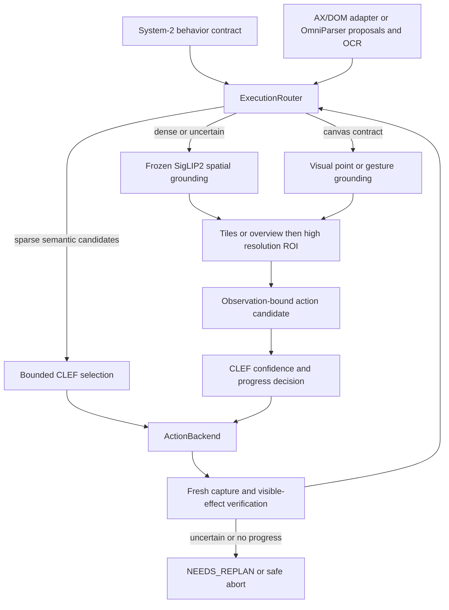

# Hybrid structured and visual execution

V2 adds an opt-in Foundation ViT grounding path alongside CLEF and OmniParser.
Structured execution remains the default for existing installations. The visual
path requires its own model weights and ML interpreter; it never substitutes
random weights when a checkpoint is missing.



## Routing and contracts

`Contract.execution_mode` is `AUTO`, `STRUCTURED`, `VISUAL`, `CANVAS`, or `ASSESS`.
`ASSESS` is read-only goal verification: no candidate construction, spatial
input grounding, or input delivery. It retains the existing two-fresh-observation
completion and safety gates; insufficient evidence returns `NEEDS_REPLAN` or
`LOW_CONFIDENCE`, never input permission.
Use it after a delivered input with uncertain runtime outcome, rather than
blindly repeating the action. AUTO and its input policy remain unchanged.
The execution contract
is distinct from CLEF's `ACT`, `WAIT`, `BLOCKED`, `COMPLETED`, and `NEEDS_REPLAN`.
AUTO counts valid interactive actions **before** CandidateBuilder truncation.
The threshold applies within a supplied target region; logs retain the full
screen count so a sparse editor can remain structured on a dense screenshot.
A unique exact native semantic target takes precedence. Otherwise a count above
`structured_candidate_threshold` routes to VISUAL; zero useful objects routes to
CANVAS. A low CLEF action/mode confidence or high normalized action entropy can
also trigger visual fallback, preserving CLEF safety and replan vetoes.

Only bounded candidate targets and bounded semantic hints enter CLEF's decision
context. OmniParser continues to supply proposals, OCR, metadata and candidates;
its full object roster is no longer automatically a CLEF choice roster.

`visual_intent` describes the target, optional normalized screenshot region and
gesture.

Goals longer than the visual query's 1,000-character limit require an explicit
`visual_intent.query`; the router escalates without truncating the planner goal.
The initial SigLIP2 text encoder also has a 64-token context. It refuses longer
queries with NEEDS_REPLAN instead of dropping a target qualifier. Supply a
concise explicit target query while retaining the complete planner contract.

For example, an MCP `computer_run` contract can include:

```json
{
  "goal": "Select the visible mesh in the viewport",
  "success_conditions": ["The requested mesh is visibly selected"],
  "execution_mode": "CANVAS",
  "visual_intent": {
    "query": "cheek on the left side of the visible face mesh",
    "operation": "click",
    "region": {"x1": 0.05, "y1": 0.08, "x2": 0.8, "y2": 0.85}
  },
  "max_steps": 6
}
```

Regions in this example are illustrative contract data, not application-specific
coordinates in the implementation. Drag requires `query` and `end_query`;
stroke additionally accepts bounded `path_queries`. Point primitives include
click, double_click, move, scroll, drag and stroke. Scroll specifies direction
and magnitude. WAIT remains owned by the runtime, not an OS input adapter.
Structured typing/hotkeys retain their existing scoped payload checks.

`target_geometry` defaults to `point`. An explicit `horizontal_line` target
combines responses along one thin horizontal boundary while subtracting
separated competing parallel bands. Boundaries within one patch pitch can merge;
this geometry cannot certify subpatch boundary separation. It requires a span of at least two patches;
it does not reinterpret a point or use application coordinates. For a drag,
this geometry applies to its start query; the endpoint remains a point target.

Generated pointers bind the screenshot hash, geometry and foreground identity.
The runtime rechecks pixels immediately before delivery. A point never acquires
a new reference just because the screen changed. Sensitive-surface checks cover
the complete gesture's convex surface. DesktopAction owns native OS input and
release; models only produce targets. Other ActionBackend implementations can
be injected through the existing protocol. This slice uses the native backend;
it does not yet ship a CUA Driver adapter.

If a generated visual pointer becomes stale within the same foreground context,
the runtime reparses and regrounds the fresh frame before choosing another action.
This requires established foreground identity and bounds; missing metadata never
proves a same-window redraw. Windows supplies native HWND/geometry, and Linux
X11 capture resolves the native input focus to its top-level window and bounds,
checking that context again after capture. PointerRoot reports unknown identity.
On capture paths without native identity, stale model pointers require replanning.
`visual_stale_retries` bounds these retries; they also consume the contract step
budget. Redraws and tooltips in the same window can trigger fresh perception,
grounding and a new decision; the original pointer is never rebound to new pixels.
Planner-supplied coordinates, foreground-window identity changes and capture
geometry changes still fail immediately.
During readiness, consecutive current-region stability is checked independently
of the original pixels. A stable changed region triggers fresh grounding, never
authorization of the old pointer.
Windows double-click retains its original HWND between presses and refuses a
second press after focus changes, while releasing the first held button.

## Model and high resolution inference

The initial backend is the frozen `google/siglip2-base-patch16-512` checkpoint,
pinned to `a89f5c5093f902bf39d3cd4d81d2c09867f0724b`. This checkpoint uses the
fixed-resolution SigLIP architecture. [The official model card](https://huggingface.co/google/siglip2-base-patch16-512)
and [Transformers documentation](https://huggingface.co/docs/transformers/model_doc/siglip2)
describe the image/text encoder and pretrained projection.

`VisionBackbone.encode_image`, `TextEncoder.encode_query`, and `GroundingHead`
are separate interfaces. The initial readout applies the pretrained vision
attention pooler to each spatial token and compares it to the pretrained text
embedding. This is a zero-shot localization readout, not a GUI-trained detector.
It can abstain or return the wrong location for small UI controls. C-RADIO and
DINO implementations can implement these interfaces; they are not included in
this slice.

Inference defaults to overlapping native-resolution tiles. Explicit
`VisualIntent.coarse_strategy="overview"` instead encodes the entire supplied
region once for global spatial context. Only the coarse input changes: the fine
ROI radius stays in original pixels and its crop is magnified for detail.
Use tiled input for small controls and thin gesture targets unless a matching
overview-trained head has demonstrated accuracy. Edge tiles, overviews and fine
crops are letterboxed, never stretched to a square. Overlapping native tiles
are fused; a single overview retains every valid patch, including partially
padded edge patches. The grounder chooses a coarse ROI and grounds again on its
magnified crop. Every target and heatmap
sample maps back to original screenshot pixels. The fine heatmap is a spatial
probability distribution; pure padding contributes no target. The frozen
encoder retains at most 16 exact pixel-keyed feature grids to reuse coarse
inference during refinement. It never caches pointer authorization.

An optional dense grounding head trains 102,787 parameters at hidden size 64
while freezing both encoders. It predicts per-patch binary target scores and
bounded subpatch offsets. Every valid patch intersecting an annotated target
is positive; its offset points into that intersection. Known absent queries
train binary scores without a fictitious target. A checkpoint contains only
safetensors V3 weights and provenance metadata. Each trained coarse strategy
must declare independent positive and negative rows in both splits, with counts
matching the complete manifest. Serving refuses a strategy absent from that
head's provenance and escalates to `NEEDS_REPLAN`; earlier V1/V2 checkpoints
are rejected. Serving also rejects missing,
nonfinite, mismatched, untrained, old-format or split-contaminated checkpoints.

For a supervised map, binary scores >= 0.5 define target support. Confidence
compares the peak component's posterior mass with the largest competing
component: `(primary - competitor) / (primary + competitor)`, clipped to zero
and capped by the peak binary score. Both coarse and fine peaks must meet
`visual_presence_threshold` (default 0.9). This preserves spatial ambiguity
while avoiding confidence loss from diffuse, below-support background.
Other active components are not included in that two-component denominator;
the score is a routing heuristic, not a calibrated success probability.
Horizontal-line queries compare the selected row band with the strongest
parallel band and retain the minimum horizontal-span check. A supervised fine
crop wholly inside a target can instead use its minimum binary score, only
when every valid patch meets the same presence threshold. Coarse flat maps
still refuse input. Maps without binary scores retain relative-logit support.

## Setup

Install `requirements/ml-visual.in` in an isolated interpreter, or use an
existing compatible CLEF interpreter. Download the pinned backbone with:

```sh
clef-use models download --visual
clef-use models list --visual
```

Enable it in the existing configuration:

```toml
visual_grounding = true
visual_python = "/absolute/path/to/visual-env/bin/python"
visual_device = "cpu"
# Optional, only after actual supervised head training:
# visual_head = "/absolute/path/to/trained-head.safetensors"
structured_candidate_threshold = 24
visual_confidence_threshold = 0.55
visual_presence_threshold = 0.9
visual_refinement_retries = 2
visual_stale_retries = 2
# CPU CLEF only; float32 remains the default. Verify predictions on your tasks.
# cpu_compute_dtype = "bfloat16"
clef_entropy_threshold = 0.8
```

Production model workers load the local configured cache offline.
CPU CLEF uses Torch SDPA; startup metadata records the loaded text model's
attention implementation. This avoids the eager attention-score matrix on
the tested Torch 2.11 CPU provider. The CPU dtype setting remains independent.
Explicit VISUAL/CANVAS contracts without a visual backend escalate rather than silently
using structured execution. CLI supports `run --mode`, `--visual-query` and
`--coarse-strategy`;
MCP accepts the full visual intent.

For optional head training, supply a JSON `samples` array with `image`, `query`,
absolute-pixel `bbox` `[left, top, right, bottom]`, and `split` (`train` or
`validation`). Optional `region` contains normalized `x1/y1/x2/y2` serving geometry;
a positive box must fit it. Use `bbox: null` for a query absent within that region,
or the whole screenshot when no region is supplied. Scoped absence never labels
the rest of the screenshot negative. Positive examples train both full and
the row's declared full/scoped coarse input plus fine crops at three scales.
Half-patch translations use the actual fine crop's separate x/y pitches,
including clipping and letterboxing, independently of coarse downsampling.
These translations expose the head to changing crop positions during serving.
Binary presence covers every intersecting annotation patch. Spatial cross-entropy
uses an annotation-centered Gaussian density to prefer an interior point instead
of requiring equal logits throughout a box. Per-axis sigma is the greater of
one quarter of the box extent and half a patch pitch.
Training averages losses within coarse and fine stages, gives each available
stage equal weight, and performs one optimizer update per manifest row. Adding
more fine-crop augmentations therefore does not reduce coarse-stage influence.
Rows are shuffled deterministically with the supplied seed each epoch, with
every training row visited once. This avoids repeatedly ending an epoch on
manifest blocks containing only absent targets; it does not balance classes.
An optional manifest `coarse_strategy` field defaults to `tiled`; `overview`
requires its own independent positive and negative coverage. Keep absence
controls for both input strategies when assessing a mixed head.
Both splits require
positive and negative examples; identical decoded screenshots cannot cross
splits. Keep final benchmark scenes out of both splits.

```sh
PYTHONPATH=src /path/to/ml-python scripts/train_grounding_head.py \
  manifest.json head.safetensors --epochs 100 --hidden-size 64 --device cpu --cpu-threads 4
```

The training report separates coarse and fine context losses/hits, records
optimizer updates, and reports actual end-to-end grounding on held-out
screenshots separately. Fine contexts are annotation-centered; aggregate context
hit rates can conceal failed coarse proposals. Neither metric proves an
executed GUI action or task completion.

## Verification and benchmark

The existing fresh-capture, visible-effect, no-progress, repeated-state, step
budget, desktop lock, cancellation and release gates apply to every mode.
Completion still requires goal and all success conditions on two fresh stable
observations. Executing a click or seeing pixel readiness does not imply success.
Low visual confidence receives bounded crop refinements, then NEEDS_REPLAN.

Decision records include mode, raw candidate count, bounded CLEF count,
CLEF confidence/entropy, visual confidence, coarse ROI, fine target, action,
execution result, change/readiness and per-stage/step latency. Logs remain local
and private. A null entropy/confidence is unmeasured, not a perfect score.
`step_latency_ms` measures wall time from the round's first capture through
its decision, input and verification, including visual wait intervals. Stage
durations may overlap and must not be summed into an end-to-end measurement.

The real Blender runner copies a VRM blend into a private new `/tmp` directory,
starts a fresh Xvfb and Blender process, and uses a loopback fixture/readback
server. It never touches an existing Blender session or original file.
The server authenticates each request using a random token in a private
0600 file; loopback binding alone does not authorize fixture mutations.
Its startup signal is not proof of a stable GUI; each reset flushes the redraw
and checks the visible precondition. Configure at least six steps for composite
goals and two stable completion observations after bounded stale retries.

The fixture establishes native focus on its sole visible Blender window before
either variant starts. Bare Xvfb has no window manager and otherwise reports
PointerRoot; this setup step supplies an actual window identity without changing
model queries, coordinates or confidence policy. Startup capture must contain
known identity and bounds, and both variants share this preparation.
The private startup script registers an in-memory shortcut for Blender's real
`wm.splash` operator. Splash setup uses this native keyboard event after a stable
baseline, and rejects a missing change or unstable/context-changing capture.
Pixel change establishes readiness, not the identity of the popup: inspect the
saved setup screenshots before interpreting the splash stress case. The binding
is shared by both variants and never saved into user preferences.

```sh
PYTHONPATH=src .venv/bin/python scripts/blender_hybrid_benchmark.py \
  --blend /path/to/vrm-snapshot.blend --config /path/to/benchmark-config.toml \
  --output /tmp/clef-hybrid-run --display :130 --port 19876 --setup-smoke
```

After fixture smoke succeeds, omit `--setup-smoke` to run at least five paired,
alternating trials per case. Six cases cover Properties icon, Outliner selection,
viewport selection, divider drag, a visible material-property checkbox and the
prior splash/workspace failure. Independent Blender readback establishes task
success, while runtime completion and escalation are reported separately.
The Face tasks additionally require a completed selection click in the named
editor, tied to the native active-object transition. Per-input snapshots and
the boundary before the next input attribute queued events without retries.
Missing delivery or state evidence remains unverified; a wrong-editor selection
fails the task even when Face becomes active.
The runner retains raw failed runs, mode/candidate success rates, p50/p95 and
environment/model metadata. Success mode follows actual input attempts; a final
completion assessment cannot relabel an earlier visual action as structured.
Trials executing both kinds are `MIXED`; no-input trials retain their last
attempted route, with `mode_basis` identifying this distinction. `terminal_mode`
is recorded separately. Raw routing counts and real CLEF request choice counts
have separate success breakdowns. Each trial is counted once in every count
group it encountered; `calls` records repeated occurrences, and zero-choice
assessments are counted separately. Round wall-latency summaries include stale
and failed rounds. The runtime result and history are saved before fallible
post-action screenshot/readback work. Unverified native outcomes remain in the
overall success denominator and are counted separately from confirmed failures.
Grounding-error summaries count only finite measured
samples and retain their measurement methods; abstentions are unmeasured.
Editor-region containment is a coarse grounding
error measure; it cannot certify exact tiny-icon accuracy. Dead Blender stops
the benchmark and labels unexecuted trials NOT_RUN.
The baseline uses the preserved global STRUCTURED candidate and object context,
without visual intent or regional filtering. Both variants share verification
fixes; this compares execution paths rather than historical checkouts.

On a memory-constrained host, add `--exclusive-model-workers`. This closes the
other benchmark-owned model workers before each real request and keeps the
currently selected worker warm for consecutive requests. Both baseline and
hybrid use the same policy. Stage changes reload real weights; the resulting
latencies describe that policy, not a fully resident deployment. The default
retains resident workers. Reports retain actual startup replies separately from
worker liveness; a retained startup reply does not imply current residency.
The active trial and planned input are persisted before execution, so an
interrupted trial can retain partial-input evidence without entering completed
trial denominators. Planner escalation counts only `NEEDS_REPLAN`, separately
from errors, explicit abort and blocked state.

See [current acceptance evidence and failures](HYBRID_VALIDATION.md). The presence
of this runner does not assert that the six model-driven tasks passed. Zero-shot
confidence measures spatial ambiguity. With a trained head, the score also
requires binary target evidence. Balanced training makes this an uncalibrated
score, rather than a probability of target presence or click correctness.
The default 0.55 gate must be checked against full-resolution positive and
absent-target controls; training loss alone does not establish safe input.
Earlier private heads were evaluated with a 0.35 profile. Those experiments
did not establish a new default or calibrated correctness probability. Reused
development-scene results cannot establish independent accuracy.
The Gaussian checkpoint documented in validation wrongly accepted three absent
targets at 0.35; that threshold is prohibited for that checkpoint. Its executed
controls passed at the shipped 0.55 gate.
The newer overview head also rejects all executed negative configurations at
0.55, but its posthoc 0.25 global gate falsely accepts an absent Save As target.
Its original native retry retains 0.55; annotation hits alone do not authorize
reducing the gate.
